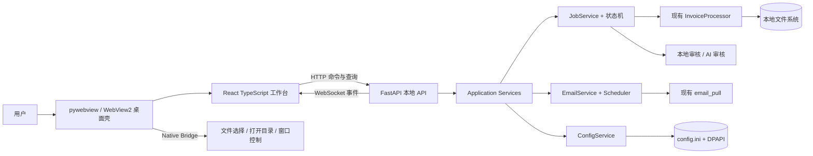
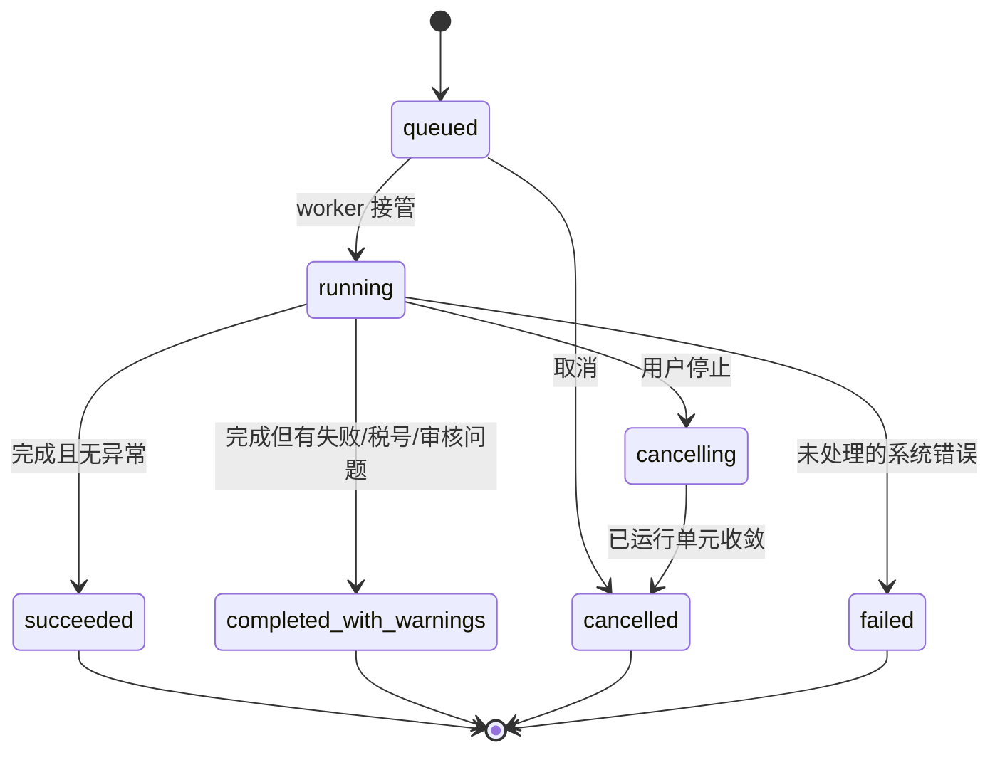

# SYNTEC 电子票据处理系统 Web 桌面化重构架构设计

> 文档状态：v7.0.12 当前实现基线与交付边界
> 当前版本：v7.0.12
> 适用平台：Windows 10/11、SYNTEC 域控环境
> 本文记录 Web 桌面化重构的架构决策、实施边界与验收标准，具体实现以当前源码为准。

## 1. 背景与目标

重构前的桌面界面同时承担渲染、线程池调度、任务状态、邮箱拉取、归档和审核编排，导致状态同步、测试和界面迭代越来越困难。当前实现已将任务状态、邮箱轮询、归档和审核编排拆分到应用层、API、Web 工作台和桌面桥接层；目录监听仍不是当前版本能力。

本次重构采用“Python 本地后端 + Web 前端 + Windows WebView 桌面壳”模式：

- 保留现有 `src/core/` 票据处理算法和测试资产；
- 将业务流程从 Qt UI 抽到可测试的 Python 应用层；
- 使用 FastAPI 提供本机 HTTP API，使用 WebSocket 推送实时任务事件；
- 使用 React + TypeScript 构建类 VS Code 的工作台界面；
- 使用 pywebview 调用系统 WebView2，维持单个 Windows 桌面程序的使用体验；
- 最终继续用 PyInstaller `--onedir --windowed --noupx` 交付，不要求用户安装 Python、Node.js 或启动浏览器。

### 1.1 成功标准

1. 用户双击 EXE 后进入桌面窗口，不出现控制台和外部浏览器。
2. 原有目录选择、拖入 PDF、开始/停止、实时进度、日志、输出目录、邮箱拉取、自动处理、设置、本地审核和 AI 审核能力均保留。
3. 核心业务规则与当前测试结果不回归，且 `src/core/` 不依赖 FastAPI、pywebview 或前端代码。
4. UI 刷新、窗口关闭或 WebSocket 短暂断开不会中止后台任务；重新连接后可恢复当前快照。
5. 前后端接口有稳定的数据模型，UI 不再直接编排线程或调用核心私有方法。

### 1.2 非目标

- 不改成公网 Web 服务，不支持远程多人访问；
- 不在首期引入账号、权限、云数据库或分布式队列；
- 不重写 PDF 解析、命名、去重、税号检查、合并和审核算法；
- 不追求逐像素复制 VS Code，只采用其成熟的工作台信息架构；
- 首期仍只允许一个处理任务运行，避免共享去重缓存和输出目录并发冲突。

## 2. 架构决策

| 编号 | 决策 | 原因 |
|---|---|---|
| ADR-001 | FastAPI + Pydantic | 类型明确、OpenAPI 可生成、WebSocket 原生支持，适合本地 API |
| ADR-002 | React + TypeScript + Vite | 组件生态成熟、构建产物静态化、适合复杂工作台状态 |
| ADR-003 | pywebview + Edge WebView2 | Windows 自带运行时概率高，包体显著小于 Qt WebEngine/Electron，保留原生桌面能力 |
| ADR-004 | HTTP 命令 + WebSocket 事件 | 命令可重试和测试，进度/日志可实时推送，职责清楚 |
| ADR-005 | 应用层 `JobService` 单独编排 | 消除 UI 对线程池、核心私有方法和归档流程的直接控制 |
| ADR-006 | 单 Python 进程、后端后台线程 | 降低打包和进程回收复杂度；CPU/I/O 工作仍由受控线程池执行 |
| ADR-007 | 配置继续使用 INI + DPAPI | 兼容已有用户配置和密钥，首期不做无收益迁移 |
| ADR-008 | 前端资源全部内置 | 域控和离线环境不依赖 CDN、在线字体或远程脚本 |

### 2.1 pywebview 预研门槛

桌面集成需验证目标机上的 WebView2、中文路径、DPI、文件选择和 PyInstaller 启动。当前采用 pywebview + Edge WebView2；若部署环境不满足，需单独评估壳层替代方案，不能改变 HTTP、WebSocket、应用层和 React 前端契约。

## 3. 总体架构



### 3.1 分层规则

| 层 | 允许依赖 | 禁止依赖 |
|---|---|---|
| `domain` | 标准库、领域模型 | FastAPI、WebSocket、React、pywebview、Qt |
| `core` | 标准库、PDF/Excel 库、领域模型 | UI、HTTP、桌面壳 |
| `application` | `domain`、`core`、基础设施接口 | React、pywebview |
| `infrastructure` | application 端口、文件系统、INI、DPAPI、IMAP | 前端组件 |
| `api` | application 服务、Pydantic/FastAPI | 直接编排 `InvoiceProcessor` |
| `desktop` | API 启停、pywebview、原生能力 | PDF 业务规则 |
| `web` | API 契约生成类型、UI 状态 | Python 文件系统实现细节 |

依赖方向固定为外层指向内层。FastAPI 路由只做参数验证、服务调用和响应转换；所有“能否开始、何时归档、如何停止、如何统计”的决定必须位于应用层。

## 4. 目标目录结构

```text
Automated-invoice-processing-main/
├── main.py                         # 新桌面入口：启动 API、WebView、退出清理
├── src/
│   ├── core/                       # 保留现有票据算法
│   ├── domain/
│   │   ├── job.py                  # Job、JobStatus、统计、结果模型
│   │   ├── events.py               # 领域事件模型
│   │   └── errors.py               # 稳定错误码与领域异常
│   ├── application/
│   │   ├── job_service.py          # 处理编排、取消、快照、结果
│   │   ├── invoice_file_service.py # 单文件处理和人工归集
│   │   ├── audit_service.py        # 本地/AI 审核编排
│   │   ├── email_service.py        # 拉取、自动处理、归档
│   │   ├── config_service.py       # 配置校验、脱敏读写
│   │   └── event_bus.py            # 线程安全事件发布订阅
│   ├── infrastructure/
│   │   ├── config_repository.py    # 适配现有 config_manager
│   │   ├── file_system.py          # 路径扫描、复制、移动、打开
│   │   ├── scheduler.py            # 邮箱轮询与目录监听
│   │   └── log_sink.py             # 持久化日志与任务事件桥接
│   ├── api/
│   │   ├── app.py                  # FastAPI 工厂、生命周期
│   │   ├── dependencies.py         # 服务注入
│   │   ├── schemas.py              # API DTO
│   │   ├── errors.py               # 异常到 HTTP 错误映射
│   │   └── routes/
│   │       ├── system.py
│   │       ├── jobs.py
│   │       ├── settings.py
│   │       ├── email.py
│   │       └── files.py
│   └── desktop/
│       ├── launcher.py             # 随机端口、令牌、就绪探测、退出
│       └── native_bridge.py        # 原生目录选择与打开目录
├── web/
│   ├── src/
│   │   ├── app/                    # 路由、布局、全局初始化
│   │   ├── api/                    # HTTP 客户端、WebSocket、生成类型
│   │   ├── features/
│   │   │   ├── processing/
│   │   │   ├── inbox/
│   │   │   ├── audit/
│   │   │   └── settings/
│   │   ├── components/             # 通用控件，不含业务编排
│   │   ├── stores/                 # 连接、任务与布局状态
│   │   └── styles/                 # token、主题、响应式布局
│   ├── package.json
│   └── vite.config.ts
├── tests/
│   ├── application/                # 状态机与编排测试
│   ├── api/                        # HTTP/WebSocket 契约测试
│   └── e2e/                        # Playwright 桌面视口测试
└── build_syntec.py                 # 先构建 web，再打包 Python 与静态资源
```

重构完成后，生产代码不保留旧 UI 包或 Qt 依赖；新代码通过应用层、API 和桌面桥接层协作。

> 当前仓库以现有源码为准：配置、邮箱轮询和日志持久化分别由 `config_manager.py`、`application/email_poller.py` 和现有日志模块承担；未单独拆出的 infrastructure、scheduler 和浏览器 E2E 层属于当前交付边界。上图用于说明依赖方向，不代表必须保留的目录结构。

## 5. 应用层设计

### 5.1 任务聚合与状态机

`Job` 是一次目录处理的唯一状态源，建议最少包含：

```text
id, source_dir, output_dir, trigger, status, phase,
progress, stats, started_at, finished_at, cancel_requested,
error_code, error_message, result
```

`trigger` 取值：`manual | inbox | email`。`phase` 取值：`scan | process | post_process | local_audit | ai_audit | archive | done`。



约束：

- 进度只能由真实步骤推进，必须单调且位于 $[0, 1]$；
- 停止是协作式取消：停止提交新任务、取消未开始的 future，等待正在执行的文件完成；
- 终态不可再次变化；
- 当前只允许一个非终态处理任务，冲突请求返回 `409 JOB_ALREADY_RUNNING`；
- `JobService` 持有 `InvoiceProcessor` 实例，每个任务开始前执行 `reset_dedup()`，结束时执行 `clear_cache()`；
- 应用层不得通过修改进程当前目录表达源目录，所有路径必须显式传递。

### 5.2 处理流水线

1. 校验源目录存在、可读，扫描顶层 PDF；
2. 创建输出目录并建立任务快照；
3. 使用受控 `ThreadPoolExecutor` 处理单文件；
4. 执行现有 `post_process`；
5. 始终执行本地审核，按配置执行 AI 审核；
6. 写入审核报告；
7. 仅当 `trigger` 为 `inbox` 或 `email` 且任务进入完成态后归档源 PDF；
8. 发布最终快照并清理缓存。

首期可把当前 `_process_single_file` 和 `_move_to_manual_review` 原样迁到 `InvoiceFileService`，但应改为公开应用服务 API，不再由 UI 调用 `InvoiceProcessor` 的私有方法。

### 5.3 事件模型

所有事件使用统一信封：

```json
{
  "event_id": 42,
  "type": "job.progress",
  "occurred_at": "2026-08-16T10:30:00+08:00",
  "job_id": "01J...",
  "payload": {}
}
```

首期事件类型：

| 事件 | 关键 payload | 用途 |
|---|---|---|
| `system.ready` | `version` | 前端确认后端可用 |
| `job.snapshot` | 完整 Job DTO | 初连、重连、状态校准 |
| `job.status_changed` | `status, phase, message` | 状态栏和按钮状态 |
| `job.progress` | `progress, phase` | 真实进度 |
| `job.stats_changed` | `total, success, failure, tax_issues` | 统计视图 |
| `job.log_appended` | `level, message` | 输出面板 |
| `job.completed` | `result` | 结果与操作入口 |
| `email.pull_completed` | `downloaded, scanned, errors` | 收件箱反馈 |
| `settings.changed` | `sections` | 多视图同步配置 |

事件总线必须线程安全。每个连接使用有界队列；当慢客户端导致队列溢出时，可丢弃中间进度事件，但不能丢弃状态、错误和完成事件。前端检测 `event_id` 跳号后调用快照 API 校准。

## 6. API 契约

API 前缀固定为 `/api/v1`。错误统一返回：

```json
{
  "error": {
    "code": "JOB_ALREADY_RUNNING",
    "message": "已有任务正在处理",
    "details": {}
  }
}
```

### 6.1 HTTP API

| 方法与路径 | 用途 | 主要响应 |
|---|---|---|
| `GET /system/health` | 启动就绪探测 | 版本、构建号、运行模式 |
| `GET /jobs/current` | 当前任务快照 | Job DTO 或 `null` |
| `POST /jobs/scan` | 选择目录后预扫描顶层 PDF | 规范化目录与 PDF 数量 |
| `POST /jobs` | 启动目录处理 | `202` + Job DTO |
| `POST /jobs/{id}/cancel` | 请求协作式停止 | `202` + Job DTO |
| `GET /jobs/{id}` | 获取任务快照 | Job DTO |
| `GET /jobs/{id}/logs` | 获取日志快照/导出基础 | 分页日志 |
| `POST /email/pull` | 手动拉取邮箱 | `202` + 操作状态 |
| `GET /settings` | 获取脱敏配置 | 不返回密钥明文 |
| `PATCH /settings` | 一次性更新业务、邮箱和 AI 配置 | 原子保存后的脱敏配置 |
| `PATCH /settings/business` | 更新税号与线程数 | 更新后配置 |
| `PATCH /settings/email` | 更新邮箱配置 | 脱敏配置 |
| `POST /settings/email/test` | 测试连接 | 成功/稳定错误码 |
| `PATCH /settings/ai` | 更新 AI 配置 | 脱敏配置 |
| `POST /settings/ai/test` | 测试 AI 兼容接口 | 成功/稳定错误码 |
| `POST /native/select-directory` | 浏览器调试模式的受限占位 | 桌面模式应走 Native Bridge |

`POST /jobs` 示例：

```json
{
  "source_dir": "D:\\Invoices\\2026-08",
  "trigger": "manual"
}
```

密钥字段采用写入专用语义：读取时只返回 `configured: true/false`；更新时省略密钥字段代表不变，当前设置界面不提供清除密钥操作，杜绝前端把掩码当密钥写回。

### 6.2 WebSocket

- 地址：`/api/v1/events`；
- 建立后服务端先发送 `system.ready` 和当前 `job.snapshot`；
- 前端采用 1.5 秒起步、10 秒封顶的指数退避重连，并保留事件游标；
- WebSocket 只传服务端事件，不承载开始、停止、保存设置等命令；
- 日志初始快照通过 HTTP 获取，WebSocket 只推增量；重连按 `after_event_id` 恢复并按事件号去重，避免重连时发送无限历史。

### 6.3 契约治理

Pydantic 模型是 API 单一事实源。CI 由 FastAPI OpenAPI 生成 TypeScript 类型，前端禁止手写重复 DTO。破坏性修改必须提升 API 主版本；新增可选字段保持向后兼容。

## 7. 桌面壳与安全边界

### 7.1 启动顺序

1. `main.py` 初始化日志；当前版本不提供单实例锁，多个实例互斥属于后续演进事项；
2. 在 `127.0.0.1` 随机空闲端口启动 Uvicorn 后台线程；
3. 生成本次启动随机令牌，等待 `/system/health` 就绪；
4. pywebview 打开 `http://127.0.0.1:{port}/`；
5. 关闭窗口时先请求任务停止，等待短暂收敛，再关闭调度器和 API；
6. API 启动失败时显示原生错误对话框并记录日志，禁止出现空白窗口。

### 7.2 Native Bridge 的最小职责

- `select_directory()`：系统目录选择；
- `select_pdf_files()`：选择 PDF，返回父目录或文件列表；
- `open_directory(path)`：打开已由后端确认存在的目录；
- `save_log_dialog(default_name)`：选择日志导出路径；
- `get_runtime_info()`：桌面壳版本与能力标志。

业务流程不能放入 Bridge。Web 浏览器自身无法可靠获得拖入文件的绝对路径，因此“拖入任意本地目录”必须由 pywebview 能力探针验证；若无法安全获得路径，界面保留原生“选择目录/选择 PDF”作为正式路径，拖拽只作为增强能力，不能成为唯一入口。

### 7.3 本地服务安全

- 只监听 `127.0.0.1`，禁止 `0.0.0.0`；
- 每次启动生成高熵令牌，HTTP 和 WebSocket 均校验；
- 限制 `Origin` 为本次本地地址，不启用宽泛 CORS；
- 静态资源设置严格 CSP，禁止 CDN、远程脚本和任意 iframe；
- API 永不返回邮箱授权码或 AI API Key 明文；
- 后端对所有输入路径执行规范化、存在性、类型与权限检查；
- 打开目录和日志导出只接受后端生成或用户通过原生对话框选择的路径；
- 日志不得记录令牌、授权码、API Key 或完整邮件认证错误响应。

## 8. VS Code 式 Web 界面

### 8.1 信息架构

```text
┌ Activity Bar ┬ Side Bar ┬──────────── Editor Area ────────────┐
│ 处理         │ 当前目录 │ 欢迎/处理概览/审核报告/设置编辑器   │
│ 收件箱       │ 文件概览 │                                    │
│ 审核         │ 任务历史 │                                    │
│ 设置         │          ├──────────── Bottom Panel ──────────┤
│              │          │ 输出日志 | 问题 | 任务详情          │
└──────────────┴──────────┴────────────────────────────────────┤
│ Status Bar：连接状态 | 当前阶段 | 进度 | 线程数 | 版本       │
└──────────────────────────────────────────────────────────────┘
```

- **Activity Bar**：图标导航，使用 Lucide 图标和 tooltip；
- **Side Bar**：当前功能的上下文，不放大段说明文字；
- **Editor Area**：主任务视图，可用标签页切换“处理概览”“审核报告”“设置”；
- **Bottom Panel**：可折叠输出日志、问题列表和任务详情；
- **Status Bar**：常驻连接、阶段、进度、线程数和版本信息。

### 8.2 核心交互

- 空闲态主操作为“选择目录”和“开始处理”；运行态同一位置切换为明确的“停止”；
- 进度按阶段显示，不使用模拟动画推进数值；
- 日志支持级别过滤、文本搜索、清空视图和导出，不清除磁盘日志；
- 完成后显示“打开输出目录”“查看审核问题”，失败时保留重试入口和稳定错误码；
- 关闭运行中的窗口时显示原生确认；
- 设置修改通过 PATCH 保存，字段级显示校验错误，密钥仅显示“已配置”；
- 断线时禁用命令按钮并自动重连，任务数据保留在页面上但标记为可能过期。

### 8.3 前端状态划分

- 服务端状态：任务快照、配置、邮箱操作，使用 TanStack Query 管理；
- 实时增量：WebSocket 收到后更新 Query Cache；
- 纯 UI 状态：侧栏、底部面板、活动视图，使用轻量 Zustand store；
- 表单状态只存于对应设置页，保存成功后以服务端响应覆盖；
- 禁止在多个组件各自维护 `isProcessing`，任务状态只能来自 Job DTO。

视觉上延续现有“墨韵”品牌，但采用安静、紧凑、工作台式布局。使用 CSS 变量定义颜色、间距和层级；不加载在线字体，不使用营销页、大 Hero、卡片嵌套或无业务意义的装饰动画。桌面最小尺寸建议 `1024 x 700`，并验证 `125%/150%/175%` Windows 缩放；窄窗口下侧栏可收起，关键按钮和文本不得溢出。

## 9. 业务规则不可回归清单

以下是重构验收的硬约束：

1. 增值税专票和高铁票在合并结果中追加两份完整内容，普通票一份；
2. 输出金额固定两位小数；
3. 文件名去重与内容哈希去重继续生效且线程安全；
4. 税号异常的顶层文件移动，`需人工处理/` 中的异常文件复制；
5. PDF 错误继续区分加密、损坏、无文本和未知；
6. 进度来自真实步骤，单调到 100%；
7. 停止后取消未开始任务，不再提交新任务；
8. 本地审核始终执行，AI 审核失败不阻断主流程；
9. 邮件使用 `BODY.PEEK`，附件和 Message-ID 继续去重；
10. 仅自动收件箱任务在完成后归档源 PDF；
11. 密钥继续使用 Windows DPAPI，配置和日志中不出现明文；
12. 业务核心不依赖 UI 框架。

## 10. 测试策略

| 层级 | 工具 | 必测内容 | v7.0 状态 |
|---|---|---|---|
| 核心回归 | pytest | 保留所有现有核心、邮箱、审核测试 | 已通过，163 条 |
| 应用层 | pytest + fake event bus/filesystem | 状态迁移、单任务互斥、取消、归档条件、事件顺序 | 已通过 |
| API | FastAPI TestClient/httpx | DTO 校验、错误码、密钥脱敏、冲突与路径拒绝 | 已通过 |
| WebSocket | pytest | 初始快照、事件顺序、断线重连校准、慢客户端策略 | 服务端契约已通过，真实浏览器重连待补 |
| 前端单测 | Vitest + Testing Library | store、按钮状态、设置校验、事件归并 | 当前版本未纳入 |
| E2E | Playwright | 手动选择到完成、停止、断线恢复、设置、日志过滤 | 当前版本未纳入，目标环境需手工验收 |
| 打包冒烟 | Windows 干净机/域控机 | 启动、WebView2、DPI、中文 PDF、输出打开、退出回收 | 本机更新成功/回滚冒烟已通过，目标机待验 |

每个阶段最低质量门槛：Python 测试全绿、前端类型检查全绿、无新增 Pylance/ESLint 错误。最终必须使用合成 PDF 和一份脱敏业务样本完成端到端验收。

## 11. 构建与发布

构建顺序：

1. 固定 Node.js LTS 与 npm lockfile，执行 `npm ci`；
2. 执行前端类型检查、测试和 `vite build`；
3. 将 `web/dist` 作为只读静态资源交给 FastAPI；
4. 执行 Python 测试；
5. PyInstaller 收集 `web/dist`、图标和 Python 依赖；
6. 执行现有 CompanyName、LegalCopyright、SYNTEC 命名与 `--noupx` 合规检查；
7. 在无 Node.js、无 Python 的测试账户下做启动和处理冒烟测试。

发布仍采用 onedir：

```text
dist/SYNTEC-电子票据处理系统/
├── SYNTEC-电子票据处理系统.exe
└── _internal/
    ├── web/dist/
    ├── Python 运行时
    └── 第三方依赖
```

生产模式不开放 Swagger UI，不输出 Uvicorn access log。开发模式可以独立运行 Vite 和 FastAPI，并通过显式环境变量启用文档与调试日志。

## 12. 交付状态与边界

v7.0.12 当前交付包含：FastAPI 本地服务、React 工作台、pywebview 桌面壳、邮箱自动收件、配置热加载、日志持久化、本地/AI 审核、SYNTEC 域控打包和 GitHub Release 自动更新。核心 Python 测试、API 契约、前端生产构建、打包合规以及更新器成功/回滚冒烟已通过；更新下载支持后台进度查询，完成校验后才进入整体替换。

以下事项不属于当前版本功能，后续若实施必须同步补充测试和验收记录：

- 单实例锁和目录监听；
- Vitest/Playwright 自动化套件；
- 真实浏览器 WebSocket 断线恢复；
- 干净 Windows、WebView2 和 SYNTEC 域控目标机验收；
- 跨磁盘安装目录的复制式替换。

## 14. 主要风险与控制

| 风险 | 影响 | 控制措施 |
|---|---|---|
| 目标机缺失/禁用 WebView2 | 程序无法显示 | 发布前实机验证；保留 Qt WebEngine 壳层备选 |
| 浏览器拖拽拿不到绝对路径 | 原有拖拽体验退化 | 原生目录选择为正式入口；探针验证 Bridge 增强方案 |
| UI 刷新导致状态丢失 | 用户误判任务停止 | 后端持有 Job，初连推快照，前端按事件 ID 校准 |
| 慢 WebSocket 客户端阻塞 worker | 处理性能下降 | 有界队列，事件发布非阻塞，进度事件可合并 |
| 本地端口被其他程序调用 | 配置或任务被滥用 | loopback、随机端口、启动令牌、Origin/CSP 校验 |
| 迁移中业务规则漂移 | 输出错误 | 应用层先抽取、旧新结果差异测试、硬约束清单 |
| 双 UI 长期共存 | 维护成本翻倍 | 当前仅保留 Web 工作台，旧 UI 不作为交付路径 |
| 包体与启动时间增长 | 域控部署困难 | 使用系统 WebView2，不引入 Electron，不加载 CDN |

## 15. 当前交付定义

当前源码可作为 v7.0.12 的维护和发布基线，理由如下：

- 旧 UI 不再是交付路径，业务编排集中在应用层；
- Python 核心、应用层、API、桌面壳和前端边界符合本文件约定；
- HTTP/OpenAPI、WebSocket、更新检查和回滚路径已有自动化测试；
- 业务规则清单、本机打包合规和更新器本地冒烟均已验证；
- README、项目维护说明、打包脚本和更新 SOP 已同步到当前版本。

真实浏览器、干净 Windows、WebView2/DPI 和域控权限差异仍需在目标环境验收，不能用本机测试结果替代。
